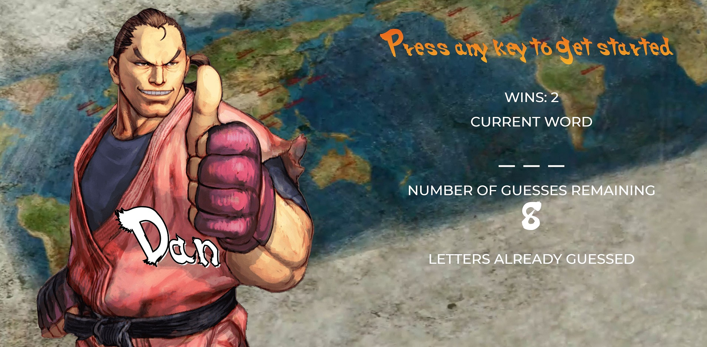

# Hangman-Game

This Hangman Game is based on Street Fighter's characters

Link: https://saloiofun.github.io/Hangman-Game/

## Getting Started

Use keyboard keys to guess letters

## The following is displayed on the page:

*  Wins: (# of times user guessed the word correctly).

If the word is akuma, it is displayed like this when the game starts: _ _ _ _ _.

As the user guesses the correct letters, reveal them: a k _ _ a.

* Number of Guesses Remaining: (# of guesses remaining for the user).

* Letters Already Guessed: (Letters the user has guessed, displayed like L Z Y H).

After the user wins/loses the game should automatically choose another word and make the user play it.

A song will be played when the user guesses their word correctly.

## Tools used

* HTML 5
* CSS
* JavaScript
* Bootstrap 3

